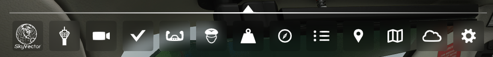

# msfs2020-remove-toolbar-activepause-button
Microsoft FlightSimulator 2020 Remove Toolbar ActivePause Button

Simple copy `RemoveToolBarActivePauseButton` to community packages folder.

## screenshots

